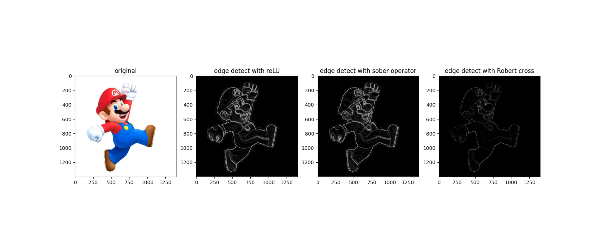

# STYLE SWAP

## changing colour to gray

used cv2 to change the colour of image from RGB to gray.

## applying blur

made a kernel of 3x3 with the formula which I have taken from Wikipedia with sigma value of 3.0.

## ReLU

tried adding ReLU at different postions in code and seen its different effect but it best suited outside the convolution function after bluring image.

## kernel for different edge detection 

made array with different orientation to see which edge it will highlight 

## combination

used 2 type of combination techniques 
1) sqrt((Gx)^2^ +(Gy)^2^)-(worked prety good)
2) average of all terms(does not worked properly)

